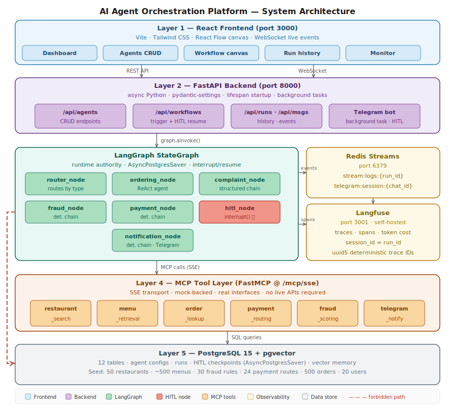
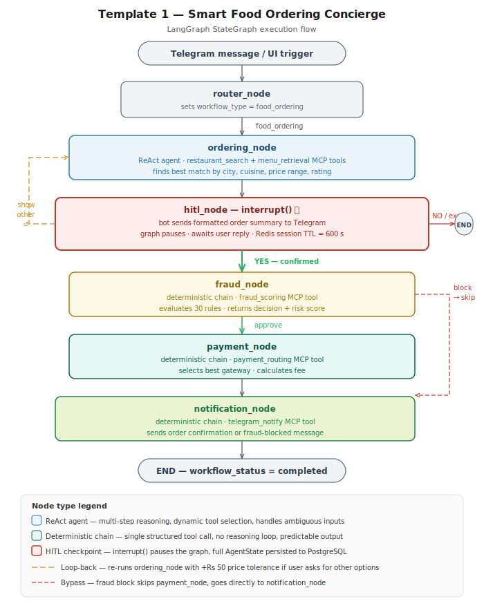
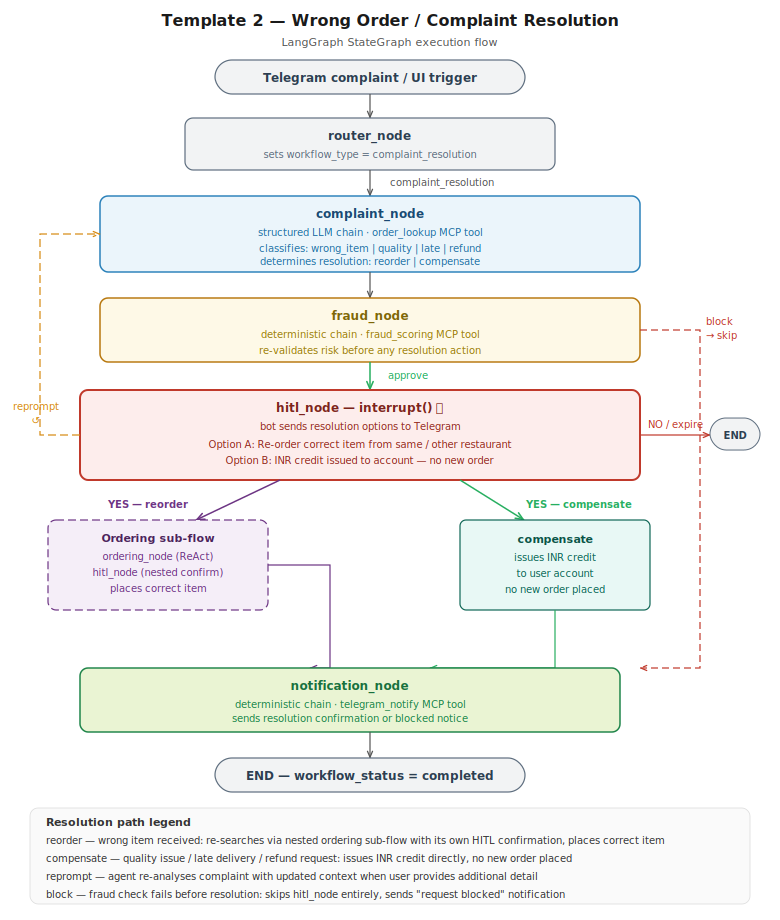

# AI Agent Orchestration Platform

> Multi-agent LangGraph workflows with HITL via Telegram, real MCP tools,
> and a full React monitoring dashboard — running locally with one command.


A production-inspired multi-agent workflow system where users create AI agents,
configure them through a web UI, and assemble them into collaborative workflows
with real-time monitoring, persistent checkpoints, and human confirmation.

> Architecture and workflow diagrams are included in `docs/`. Screenshots and demo GIFs can be captured after running the stack.

---

## Table of Contents

1. [Architecture](#architecture)
2. [Service Endpoints](#service-endpoints)
3. [Quick Start](#quick-start)
4. [Features](#features)
5. [Workflow Templates](#workflow-templates)
6. [HITL Flow](#hitl-flow-human-in-the-loop)
7. [Code Architecture](#code-architecture)
8. [Langfuse Observability](#langfuse-observability)
9. [MCP Tool Layer](#mcp-tool-layer)
10. [Agent Configuration](#agent-configuration)
11. [How to Add a New Workflow Template](#how-to-add-a-new-workflow-template)
12. [How to Add a New Messaging Channel](#how-to-add-a-new-messaging-channel)
13. [Running Tests](#running-tests)
14. [Environment Variables](#environment-variables)
15. [Seed Data](#seed-data)
16. [Project Structure](#project-structure)
17. [Runtime & Framework Choices](#runtime--framework-choices)

---

## Architecture



The platform has five runtime layers:

| Layer | Technology | Responsibility |
|---|---|---|
| Frontend | React + React Flow | Visual workflow builder, run dashboard, live monitoring |
| Backend | FastAPI | REST API, WebSocket streams, Telegram bot background task, MCP mount |
| Runtime | LangGraph StateGraph | Graph execution, conditional routing, HITL interrupt/resume |
| Tool layer | FastMCP at `/mcp/sse` | Business data access through six MCP tools |
| Data | PostgreSQL 15 + Redis 7 | SQLModel persistence, LangGraph checkpoints, event streams, HITL sessions |

### Docker Compose Services

| Service | Image | Role |
|---|---|---|
| `postgres` | pgvector/pgvector:pg15 | Primary database — agent configs, runs, seed data, HITL checkpoints |
| `redis` | redis:7-alpine | WebSocket event streaming + Telegram session state |
| `backend` | local build | FastAPI + LangGraph runtime + Telegram bot + MCP server |
| `frontend` | local build | React + Vite dev server |
| `langfuse-web` | langfuse/langfuse:3 | Observability UI (port 3001) |
| `langfuse-worker` | langfuse/langfuse-worker:3 | Async trace ingestion worker |
| `langfuse-postgres` | postgres:15 | Langfuse's own DB (separate from platform DB) |
| `langfuse-clickhouse` | clickhouse:24.12 | Langfuse trace analytics store |
| `langfuse-minio` | minio/minio | Langfuse object storage for events/media |
| `langfuse-redis` | redis:7-alpine | Langfuse internal queue |

---

## Service Endpoints

| Service | URL | Notes |
|---|---|---|
| Web UI | http://localhost:3000 | Main platform dashboard |
| API (REST) | http://localhost:8000 | FastAPI backend |
| Swagger docs | http://localhost:8000/docs | Interactive API explorer |
| Health check | http://localhost:8000/health | Returns `{"status": "ok"}` |
| MCP server | http://localhost:8000/mcp/sse | FastMCP SSE endpoint |
| Langfuse UI | http://localhost:3001 | LLM traces, costs, prompts |
| MinIO console | http://localhost:9001 | Langfuse object storage UI |

---

## Quick Start

### Prerequisites

- Docker Desktop + Docker Compose v2
- An OpenAI API key (`sk-...`)
- A Telegram bot token — create one via [@BotFather](https://t.me/botfather)

### 1. Clone and configure

```bash
git clone <repo-url>
cd agent-platform
cp .env.example .env
```

Edit `.env` — minimum required:

```env
OPENAI_API_KEY=sk-...
TELEGRAM_BOT_TOKEN=<your-bot-token>
```

All other variables have working defaults for local Docker Compose usage. Langfuse traces are optional, but require `LANGFUSE_PUBLIC_KEY` and `LANGFUSE_SECRET_KEY` to be set before traces appear in the UI.

### 2. Start the platform

```bash
docker compose up --build
```

First startup automatically:
- Creates all 12 PostgreSQL tables via SQLModel
- Seeds mock data (50 restaurants, ~500 menu items, 24 payment routes, 30 fraud rules, 500 orders, 200 transactions, 20 users)
- Seeds 5 default agent configurations with real system prompts from the agent modules
- Seeds 2 workflow templates
- Initialises local Langfuse with an admin user and project

Subsequent starts skip seeding and boot immediately (~3 seconds).

To see traces in the local Langfuse UI, create/copy a project API key pair in Langfuse and set `LANGFUSE_PUBLIC_KEY` and `LANGFUSE_SECRET_KEY` in `.env`, then restart the backend.

### 3. Get your Telegram chat ID

Message your bot anything on Telegram, then:

```bash
curl "https://api.telegram.org/bot<YOUR_TOKEN>/getUpdates"
```

Find `"chat": {"id": <number>}` in the response. Use this in the workflow trigger modal.

---

## Features

### Agent Management (CRUD)
- Create, read, update, and delete agents via the **Agents** page
- Per-agent configuration: name, role, system prompt, model (`gpt-4o` / `gpt-4o-mini`), tools, channels
- Advanced configuration: cron schedule, memory window, skills metadata, interaction rules, guardrails
- **Config-active badge**: agents whose DB config is actually loaded at runtime (`ordering`, `complaint`) are distinguished from fixed-behavior agents
- **Workflow usage badge**: each agent card shows which workflow templates reference its role
- Default agents seeded on startup from real Python agent modules — prompts always match what the runtime uses

### Workflow Builder
- Visual canvas powered by React Flow
- Nodes represent LangGraph graph nodes; edges show routing logic with labels (`approve`, `block`, `YES`, `retry`, `re-order`, `reprompt`)
- Loop-back edges shown as dashed lines (HITL retry, complaint reprompt, ordering → HITL)
- Nodes highlight with a pulsing indicator during live execution
- Trigger workflows directly from the canvas
- Two pre-loaded templates selectable from the UI

### Live Monitoring Dashboard
- Real-time event feed via WebSocket (`/ws/monitor`)
- Colour-coded by node (`ordering` = blue, `fraud` = amber, `hitl` = pink, etc.)
- Every event includes `run_id` — Dashboard auto-refreshes the Runs table when a new run appears or when a workflow completes
- Token usage and execution timeline visible per run

### Run History
- Full execution event log stored in PostgreSQL per run
- Filterable by workflow type and status
- Drill-in panel shows execution events and token breakdown per agent node
- Status values: `running`, `hitl_pending`, `completed`, `failed`, `cancelled`

### Human-in-the-Loop (HITL)
- Powered by LangGraph `interrupt()` + `Command(resume=...)`
- Full AgentState persisted to PostgreSQL via `AsyncPostgresSaver`
- Users confirm or reject via **Telegram**; state resumes from exactly where it paused
- Session expires after 10 minutes with an expiry notification
- Nothing consequential (order placement, payment) executes without explicit user YES

### Telegram Integration
- Bot runs as a FastAPI background task on startup
- Handles multi-turn HITL conversation (`YES` / `NO` / `reprompt`)
- `thread_id = Telegram chat_id` — guarantees correct state resumption
- Active sessions tracked in Redis with TTL

### MCP Tool Layer (FastMCP)
Six tools mounted at `/mcp/sse` (SSE transport):

| Tool | Description |
|---|---|
| `restaurant_search` | Search 50 seeded restaurants by city, cuisine, price, rating |
| `menu_retrieval` | Fetch menu items for a restaurant |
| `order_lookup` | Retrieve a user's most recent order (for complaint resolution) |
| `payment_routing` | Select best gateway from 24 configured routes |
| `fraud_scoring` | Evaluate transaction against 30 rule-based fraud rules |
| `telegram_notify` | Send Telegram message via the platform bot |

All tools are mock-backed with real interfaces — no live third-party APIs required.

### Langfuse Observability (self-hosted)
See [Langfuse Observability](#langfuse-observability) section below.

---

## Workflow Templates

### Template 1 — Smart Food Ordering Concierge

**Trigger:** Telegram message or UI trigger  
**Example:** `Order chicken biryani under Rs300, 4+ stars, Hyderabad`



**Graph summary:** `router` → `ordering` → `hitl`; `YES` continues through `fraud` → `payment` → `notification`, retry loops back to `ordering`, and `NO`/expiry ends the workflow. Fraud blocks skip payment and go directly to notification.

**HITL checkpoint message (sent to Telegram):**
```text
Restaurant: Meghana Foods ⭐ 4.6
Item: Chicken Dum Biryani
Price: Rs280 · Delivery: ~35 mins
Payment: Juspay UPI · Fee: Rs5.60 · Total: Rs285.60
Risk score: 14/100 ✓

Reply YES to confirm or NO to cancel
```

**Alternate paths:**
- `NO` → Order cancelled
- `"show other options"` → re-runs ordering with relaxed constraints
- No reply in 10 min → session expired message

---

### Template 2 — Wrong Order Resolution

**Trigger:** Complaint message via Telegram or UI trigger  
**Example:** `I ordered chicken biryani but got veg biryani from Ohri's`



**Graph summary:** `router` → `complaint` → `fraud`; approved complaints pause at `hitl`, fraud blocks notify immediately, reprompts loop back to `complaint`, re-orders enter `ordering` and require a second food-confirmation HITL, and compensation/NO/expiry routes to `notification`.

**HITL checkpoint message:**
```text
Resolution for your complaint:
Re-order: Chicken Biryani from Paradise Restaurant
OR
Refund: Rs280 credit to your account

Reply YES to confirm or NO to cancel
```

**Resolution types:**
- `reorder` — wrong item received; re-search and place the correct order (goes through the Ordering sub-flow with its own HITL)
- `compensate` — quality issue, late delivery, or explicit refund request; issues INR credit

---

## HITL Flow (Human-in-the-Loop)


1. Workflow starts from the UI or Telegram with `graph.ainvoke(initial_state, config={"configurable": {"thread_id": chat_id}})`.
2. Nodes run until `hitl_node` calls `interrupt()`, at which point `AsyncPostgresSaver` persists the full `AgentState`.
3. The backend or Telegram bot sends the HITL prompt and stores `telegram:session:{chat_id}` in Redis with a 10-minute TTL.
4. The user replies `YES`, `NO`, or correction text on Telegram.
5. The bot resumes the graph with `Command(resume=...)`, using the same `thread_id`.
6. The graph resumes from the checkpoint and routes to fraud/payment/notification, retry, support escalation, or END.

Key constraint: `thread_id` MUST equal the Telegram `chat_id`. This is what enables correct state resumption across turns.

**Session expiry:** Redis TTL is 600 seconds for every HITL session. After 10 minutes without a reply, the bot clears the session and asks the user to start a new request.

| Action | Requires HITL |
|---|---|
| Placing a food order | **Yes — always** |
| Payment processing | **Yes — always** |
| Complaint resolution | **Yes — always** |
| Fraud scoring | No — internal decision |
| Restaurant search | No — research phase |
| Telegram notifications | No — autonomous |

---

## Code Architecture


Key design rules enforced in the codebase:
- `AgentState` is the single state contract between graph nodes.
- LangGraph node names match React Flow node IDs exactly, which enables live node highlighting.
- Ordering and complaint agents load DB config at runtime; fraud, payment, and notification are deterministic fixed-behavior nodes.
- Agents access business data through MCP tools only; backend service code owns persistence tables such as `agents`, `workflow_runs`, and `run_messages`.

---

## Langfuse Observability

Langfuse runs as a fully self-hosted stack inside `docker compose up` — no external account needed.

### Access

| URL | Credentials |
|---|---|
| http://localhost:3001 | `admin@yuno.local` / `admin1234` |

Login credentials are configured by `LANGFUSE_INIT_USER_EMAIL`, `LANGFUSE_INIT_USER_NAME`, and `LANGFUSE_INIT_USER_PASSWORD` in `.env`.

### What is traced

Every agent node execution is wrapped in a `langfuse_node_span()` context manager:

- **Traces** — one trace per node execution, grouped under a single session per workflow run (`session_id = run_id`)
- **Deterministic trace IDs** — `uuid5(run_id + node_name)` ensures that both the initial execution and any HITL-correction re-runs of the same node appear under the same Langfuse trace
- **LangChain callbacks** — the Langfuse `CallbackHandler` is injected into every agent invocation, capturing input/output tokens, latency, and model name automatically
- **Graceful degradation** — if Langfuse keys are absent or the service is unreachable, `langfuse_node_span()` is a no-op and the workflow continues normally

### Configuration

Langfuse runs locally with `docker compose up`, but traces are only visible after the backend has a valid Langfuse API key pair.

For the local self-hosted setup:

1. Open http://localhost:3001.
2. Log in with `LANGFUSE_INIT_USER_EMAIL=admin@yuno.local` and `LANGFUSE_INIT_USER_PASSWORD=admin1234`.
3. Create or copy a project API key pair from the Langfuse project settings.
4. Paste those values into `.env`:

```env
LANGFUSE_PUBLIC_KEY=pk-lf-...
LANGFUSE_SECRET_KEY=sk-lf-...
LANGFUSE_HOST=http://localhost:3001
LANGFUSE_BASE_URL=http://localhost:3001
```

5. Restart the backend so `core.observability.langfuse_node_span()` can attach Langfuse callbacks.

To use Langfuse Cloud instead of self-hosted, set:
```env
LANGFUSE_PUBLIC_KEY=pk-lf-...
LANGFUSE_SECRET_KEY=sk-lf-...
LANGFUSE_HOST=https://cloud.langfuse.com
LANGFUSE_BASE_URL=https://cloud.langfuse.com
```
Create those keys in your Langfuse Cloud project. You can remove the `langfuse-*` services from `docker-compose.yml` when using Cloud.

---

## MCP Tool Layer

Tools are implemented with FastMCP and mounted as an ASGI sub-application at `/mcp/sse` alongside FastAPI.


| Tool | Backing data | Purpose |
|---|---|---|
| `restaurant_search` | 50 seeded restaurants + menu embeddings | Search by city, cuisine, price, rating, and restaurant name |
| `menu_retrieval` | ~500 menu items | Fetch available items for a restaurant |
| `order_lookup` | 500 historical orders + users/restaurants | Retrieve recent order context for complaint resolution |
| `payment_routing` | 24 gateway configurations | Select payment gateways by success rate, method, and fee |
| `fraud_scoring` | 30 rule-based fraud rules + transaction context | Evaluate transaction risk and approve/block |
| `telegram_notify` | Platform Telegram bot | Send user-facing workflow notifications |

**Rule:** Agents never query PostgreSQL directly. All business data access goes through MCP tools.

Exception: persistence tables (`agents`, `workflow_runs`, `run_messages`) are managed by the backend service layer only.

---

## Agent Configuration

Agents are configured via the Agents page in the UI. Configuration is stored in PostgreSQL and loaded at workflow start for runtime-configurable roles.

| Field | Type | Runtime-applied | Description |
|---|---|---|---|
| Name | string | — | Unique display name for the agent card |
| Role | string | Yes | Determines which workflow node/builder uses the config |
| System prompt | text | Yes (`ordering`, `complaint`) | Prompt used by configurable LLM-backed agent roles |
| Model | select | Yes (`ordering`, `complaint`) | `gpt-4o` or `gpt-4o-mini` |
| Tools | multi-select | Yes (`ordering`, `complaint`) | MCP tool names available to the agent |
| Channels | select/list | UI metadata | `telegram` or no direct messaging channel |
| Schedule | cron string | UI metadata | Optional future scheduling metadata |
| Memory window | integer | UI metadata | Stored memory configuration metadata |
| Skills | string list | UI metadata | Display labels for agent capabilities |
| Interaction rules | text | UI metadata | Stored behavioral notes |
| Guardrails | JSON | UI metadata | Stored policy/limit metadata |

### How DB config maps to runtime

| Agent role | DB config applied at runtime | Notes |
|---|---|---|
| `ordering` | **Yes** — model, system_prompt, tools loaded via `_load_agent_config("ordering")` | Edit in UI → affects next run |
| `complaint` | **Yes** — model, system_prompt, tools loaded via `_load_agent_config("complaint")` | Edit in UI → affects next run |
| `fraud` | No — hardcoded deterministic chain | UI edits stored but not loaded at runtime |
| `payment` | No — hardcoded deterministic chain | UI edits stored but not loaded at runtime |
| `notification` | No — hardcoded deterministic chain | UI edits stored but not loaded at runtime |

The Agents page shows a **"Config applied"** (green) or **"Fixed behavior"** (grey) badge on each card to make this distinction visible.

### Agent seeding

On every startup, `seed.py` imports `ORDERING_SYSTEM`, `FRAUD_PROMPT`, etc. directly from the agent Python modules and upserts them into the `agents` table. This ensures the DB prompt always matches what the runtime actually uses — there are no duplicated prompt strings.

---

## How to Add a New Workflow Template

> **Node naming constraint:** LangGraph node names must match React Flow node IDs exactly. `current_step` in `AgentState` maps directly to the React Flow node that pulses during live execution.

### Step 1 — Implement the node function

In `backend/graph/nodes.py`:

```python
async def your_node(state: AgentState) -> dict:
    run_id = state["run_id"]
    await _log(run_id, "your_node", "node_start", {"message": "Running..."})
    config = await _load_agent_config("your_role")
    # ... agent logic ...
    await _log(run_id, "your_node", "node_complete", {"result": result})
    return {**state, "current_step": "your_node", "your_result": result}
```

### Step 2 — Add the graph builder

In `backend/graph/builder.py`:

```python
def build_your_template_graph(checkpointer):
    graph = StateGraph(AgentState)
    graph.add_node("router",       router_node)
    graph.add_node("your_node",    your_node)
    graph.add_node("notification", notification_node)
    graph.set_entry_point("router")
    graph.add_conditional_edges("router", route_from_router)
    graph.add_edge("your_node", "notification")
    graph.add_edge("notification", END)
    return graph.compile(checkpointer=checkpointer)
```

Register in `init_graphs()`:
```python
GRAPHS["your_template"] = build_your_template_graph(checkpointer)
```

### Step 3 — Add routing

In `backend/graph/edges.py` → `route_from_router()`:

```python
if state["workflow_type"] == "your_template":
    return "your_node"
```

### Step 4 — Seed the template

In `backend/scripts/seed.py` → `_upsert_workflow_templates()`:

```python
Workflow(
    name="Your Workflow Name",
    description="...",
    template_type="your_template",
    config={
        "nodes": ["router", "your_node", "notification"],
        "entry": "router",
    },
)
```

### Step 5 — Add to frontend canvas

In `frontend/src/components/WorkflowCanvas.tsx`, add node positions and edges:

```tsx
const YOUR_TEMPLATE_NODES: Node[] = [
  { id: "router",       type: "workflowNode", position: { x: 300, y: 20  }, data: { nodeId: "router",       label: "Router",        status: "idle" } },
  { id: "your_node",    type: "workflowNode", position: { x: 300, y: 140 }, data: { nodeId: "your_node",    label: "Your Node",     status: "idle" } },
  { id: "notification", type: "workflowNode", position: { x: 300, y: 260 }, data: { nodeId: "notification", label: "Notification",  status: "idle" } },
];
```

Add `"your_template"` as a valid `workflowType` prop value and wire up the node/edge arrays.

---

## How to Add a New Messaging Channel

### Step 1 — Create the channel handler

```python
# backend/channels/your_channel.py

async def start_channel() -> None:
    """Start the channel listener (webhook, polling, etc.)."""
    ...

async def handle_incoming_message(user_id: str, text: str) -> None:
    """Trigger a workflow from an incoming message."""
    from graph.builder import get_graph
    from langgraph.types import Command

    # thread_id MUST equal the channel user_id — enables HITL state resumption
    thread_id = str(user_id)
    graph = get_graph("food_ordering")
    config = {"configurable": {"thread_id": thread_id}}

    result = await graph.ainvoke(build_initial_state(text), config=config)

    if result.get("hitl_status") == "pending":
        await redis_client.setex(
            f"yourchannel:session:{user_id}", 600,
            json.dumps({"hitl_status": "pending"}),
        )
        await send_to_channel(user_id, result["hitl_prompt"])

async def handle_hitl_reply(user_id: str, text: str) -> None:
    """Resume a paused HITL workflow."""
    approved = text.strip().upper() in ("YES", "Y", "CONFIRM")
    graph = get_graph("food_ordering")
    config = {"configurable": {"thread_id": str(user_id)}}
    result = await graph.ainvoke(
        Command(resume={"approved": approved, "raw_response": text}),
        config=config,
    )
    await send_to_channel(user_id, build_result_message(result))
```

### Step 2 — Wire into lifespan

In `backend/main.py`:

```python
from channels.your_channel import start_channel

@asynccontextmanager
async def lifespan(app: FastAPI):
    ...
    asyncio.create_task(start_channel())
    yield
```

### Step 3 — Add to agent channels list

In `frontend/src/components/AgentForm.tsx`, add your channel name to the channels array.

> **thread_id constraint:** `thread_id` must equal the channel user/conversation ID. This is the key `AsyncPostgresSaver` uses to retrieve persisted `AgentState` when the user replies to a HITL prompt. A mismatch breaks HITL resume.

---

## Running Tests

Tests run inside Docker where all services are available:

```bash
# Run all tests
docker compose exec backend pytest tests/ -v

# Agent CRUD only (no LLM calls)
docker compose exec backend pytest tests/test_agent_crud.py -v

# WebSocket + Redis event delivery
docker compose exec backend pytest tests/test_websocket_delivery.py -v

# Graph topology + schema checks (no LLM)
docker compose exec backend pytest tests/test_workflow_execution.py::test_graph_compiles \
  tests/test_workflow_execution.py::test_agent_state_schema \
  tests/test_workflow_execution.py::test_edges_compile \
  tests/test_workflow_execution.py::test_nodes_importable -v

# Full LLM integration tests (requires OPENAI_API_KEY)
docker compose exec backend pytest tests/test_workflow_execution.py -v

# With coverage
docker compose exec backend pytest tests/ -v --cov=. --cov-report=term-missing
```

Tests marked `@requires_openai` skip cleanly when `OPENAI_API_KEY` is absent or still the placeholder value.

---

## Environment Variables

See `.env.example` for full documentation. Minimum required to run:

| Variable | Required | Description |
|---|---|---|
| `OPENAI_API_KEY` | **Yes** | OpenAI API key (`sk-...`) |
| `TELEGRAM_BOT_TOKEN` | Yes (for HITL) | Token from @BotFather |
| `POSTGRES_*` | Auto (Docker) | Set by docker-compose defaults |
| `REDIS_*` | Auto (Docker) | Set by docker-compose defaults |
| `SEED_DATA_ON_STARTUP` | Optional | Default: `true` (idempotent — skips if already seeded) |
| `LANGFUSE_PUBLIC_KEY` | Required for traces | Create/copy from local Langfuse or Langfuse Cloud project settings |
| `LANGFUSE_SECRET_KEY` | Required for traces | Create/copy from local Langfuse or Langfuse Cloud project settings |
| `LANGFUSE_HOST` | Optional | Default: `http://localhost:3001` (self-hosted) |
| `LANGFUSE_INIT_USER_EMAIL` | Optional | Langfuse admin login (default: `admin@yuno.local`) |
| `LANGFUSE_INIT_USER_NAME` | Optional | Langfuse admin display name (default: `Admin`) |
| `LANGFUSE_INIT_USER_PASSWORD` | Optional | Langfuse admin password (default: `admin1234`) |

---

## Seed Data

All seed data is loaded from static JSON files in `mock_data/` — no live API calls on startup.

| Dataset | Count | Detail |
|---|---|---|
| Restaurants | 50 | 10 per city: Bangalore, Mumbai, Delhi, Hyderabad, Chennai |
| Menu items | ~500 | ~10 items per restaurant, with pgvector embeddings |
| Payment gateways | 24 | 6 gateways × 4 payment methods |
| Fraud rules | 30 | Rule-based scoring engine |
| Users | 20 | Simulated user profiles |
| Orders | 500 | Historical order data |
| Transactions | 200 | Mix of successful, failed, and flagged |
| Agents | 5 | Default agents seeded from Python module constants |
| Workflow templates | 2 | food_ordering, complaint_resolution |

Seeding is idempotent. The seeder checks for existing rows before inserting.
Agent records are upserted (not skipped) so prompt changes in Python code sync to DB on restart.

---

## Project Structure

```text
agent-platform/
├── docker-compose.yml
├── docker/
│   └── clickhouse/config.d/    # ClickHouse config for Langfuse
├── .env.example
├── README.md
├── CLAUDE.md                   # Project constitution — single source of truth
├── mock_data/                  # Static seed JSON (never fetched from live APIs)
│   ├── restaurants.json
│   ├── menus.json
│   ├── payment_routes.json
│   ├── fraud_rules.json
│   ├── users.json
│   ├── orders.json
│   └── transactions.json
├── backend/
│   ├── Dockerfile
│   ├── requirements.txt
│   ├── pytest.ini
│   ├── main.py                 # FastAPI app + lifespan (tables, seeder, bot, graphs)
│   ├── api/
│   │   ├── routes/
│   │   │   ├── agents.py       # Agent CRUD
│   │   │   ├── workflows.py    # Workflow list + trigger + HITL resume
│   │   │   ├── runs.py         # Run history + run detail + HITL state
│   │   │   └── messages.py     # Run message history
│   │   └── websocket.py        # /ws/logs/{run_id} + /ws/monitor
│   ├── agents/
│   │   ├── base.py             # get_mcp_tools() — resolves tools from MCP server
│   │   ├── ordering.py         # ORDERING_SYSTEM, ORDERING_TOOLS, build_ordering_agent()
│   │   ├── fraud.py            # FRAUD_PROMPT, FRAUD_TOOLS, build_fraud_agent()
│   │   ├── payment.py          # PAYMENT_PROMPT, PAYMENT_TOOLS, build_payment_agent()
│   │   ├── notification.py     # NOTIFICATION_PROMPT, NOTIFICATION_TOOLS
│   │   └── complaint.py        # COMPLAINT_SYSTEM, COMPLAINT_TOOLS, run_complaint_analysis()
│   ├── graph/
│   │   ├── state.py            # AgentState TypedDict
│   │   ├── nodes.py            # All node functions + _log() + _load_agent_config()
│   │   ├── edges.py            # Conditional routing functions
│   │   └── builder.py          # build_*_graph() + init_graphs() + get_graph()
│   ├── mcp_tools/
│   │   ├── server.py           # FastMCP app — mounted at /mcp/sse
│   │   ├── restaurant_search.py
│   │   ├── menu_retrieval.py
│   │   ├── order_lookup.py
│   │   ├── payment_routing.py
│   │   ├── fraud_scoring.py
│   │   └── notification.py
│   ├── tg_bot/
│   │   └── bot.py              # Telegram bot + HITL dispatcher (runs as background task)
│   ├── models/
│   │   ├── agent.py            # Agent table
│   │   ├── workflow.py         # Workflow table
│   │   ├── run.py              # WorkflowRun table
│   │   ├── message.py          # RunMessage table
│   │   └── seed_data.py        # Restaurant, MenuItem, PaymentGateway, FraudRule, etc.
│   ├── schemas/                # Pydantic request/response models
│   ├── core/
│   │   ├── config.py           # pydantic-settings (reads .env)
│   │   ├── database.py         # Async PostgreSQL + AsyncPostgresSaver init
│   │   ├── redis_client.py     # Redis Streams — publish_log_event()
│   │   ├── checkpointer.py     # Global AsyncPostgresSaver singleton
│   │   └── observability.py    # langfuse_node_span() context manager
│   ├── scripts/
│   │   └── seed.py             # _upsert_default_agents() + _upsert_workflow_templates()
│   └── tests/
│       ├── conftest.py
│       ├── test_agent_crud.py
│       ├── test_websocket_delivery.py
│       └── test_workflow_execution.py
└── frontend/
    ├── Dockerfile
    ├── package.json
    ├── vite.config.ts
    ├── tailwind.config.ts
    └── src/
        ├── App.tsx
        ├── main.tsx
        ├── pages/
        │   ├── Dashboard.tsx   # Stat cards + Recent Runs (live refresh) + Live Activity
        │   ├── Agents.tsx      # Agent CRUD grid with workflow-usage badges
        │   ├── Workflows.tsx   # Workflow canvas + trigger modal
        │   ├── Runs.tsx        # Run history table + detail panel
        │   └── Monitor.tsx     # Full-screen live event feed
        ├── components/
        │   ├── Layout.tsx      # Sidebar nav + topbar
        │   ├── WorkflowCanvas.tsx  # React Flow canvas with handles + live highlighting
        │   ├── AgentCard.tsx   # Agent card with config-active / workflow-usage badges
        │   ├── AgentForm.tsx   # Agent create/edit slide-over
        │   ├── MessageHistory.tsx
        │   ├── TokenTracker.tsx
        │   ├── HITLPanel.tsx
        │   └── Toast.tsx
        └── lib/
            ├── api.ts          # Typed API client (agents, workflows, runs, messages)
            ├── websocket.ts    # createLogStream + createMonitorStream (auto-reconnect)
            └── utils.ts        # relativeTime (UTC-aware), truncateId, STATUS_COLORS
```

---

## Runtime & Framework Choices

### Why LangGraph StateGraph

LangGraph was chosen over CrewAI, AutoGen, and custom solutions:

**1. Explicit topology** — Nodes and edges are defined in code, not inferred at runtime. The graph matches exactly what the React Flow canvas displays. Bugs trace to a specific node function.

**2. First-class HITL via `interrupt()`** — Pausing mid-workflow and resuming on a Telegram reply is the core requirement. `interrupt()` + `Command(resume=...)` is the native primitive. No custom state machine.

**3. Persistent checkpoints** — `AsyncPostgresSaver` persists full `AgentState` between Telegram turns. A user can reply hours later and the workflow resumes from exactly where it stopped.

**4. Conditional routing** — `add_conditional_edges()` cleanly implements fraud-based routing and complaint resolution with pure Python. No DSL, YAML, or runtime graph compiler.

**5. Production-ready** — Handles async concurrency, multi-tenant state isolation, and stream processing out of the box.

| Alternative | Why not chosen |
|---|---|
| CrewAI | No native `interrupt()` / checkpoint resume primitive for HITL across Telegram turns |
| AutoGen | Conversation-centric rather than graph-centric; harder to map directly to React Flow topology |
| Custom runtime | Would require rebuilding async checkpointing, conditional routing, and resume semantics |
| LangGraph | First-class `interrupt()`, `AsyncPostgresSaver`, explicit graph topology, and async execution |

### Tech stack

| Layer | Technology | Version | Why chosen |
|---|---|---|---|
| Agent runtime | LangGraph StateGraph | latest stable | Explicit topology plus durable HITL interrupt/resume |
| Agent framework | LangChain `create_agent` | latest stable | Tool-calling agent abstraction with middleware support |
| HITL middleware | HumanInTheLoopMiddleware (LangChain) | latest stable | Intercepts consequential tool calls before execution |
| MCP server | FastMCP | latest stable | Lightweight local SSE tool server |
| MCP client | langchain-mcp-adapters | latest stable | Exposes MCP tools as LangChain tools |
| Backend API | FastAPI | 0.115.x | Async REST/WebSocket API with strong typing |
| ORM | SQLModel | latest stable | Pydantic + SQLAlchemy models in one schema |
| Database | PostgreSQL 15 + pgvector | pg15 | Relational persistence plus vector search for menu items |
| Event streaming | Redis Streams | 7.x | Simple fan-out for live logs and monitor feeds |
| Observability | Langfuse (self-hosted) | 3.x | Local trace, span, and token/cost visibility |
| Telegram | python-telegram-bot | 21.x | Async Telegram polling and message handling |
| Frontend | React + Vite | React 18, Vite 5 | Fast local UI iteration and typed component model |
| Workflow canvas | React Flow | 11.x | Visual graph canvas matching LangGraph topology |
| Styling | Tailwind CSS | 3.x | Fast utility styling for the dashboard UI |
| LLM provider | OpenAI GPT-4o / GPT-4o-mini | latest | Strong general reasoning with cost-effective mini option |
| Deployment | Docker Compose | v2 | One-command local stack with all dependencies |

---

*Assessment: Yuno AI Team — AI Engineer Hiring Challenge*
