<p align="center">
  <h1 align="center">Yuno AI Agent Orchestration Platform</h1>
  <p align="center"><strong>Multi-agent LangGraph workflows with Telegram HITL, MCP tools, and real-time observability.</strong></p>
  <p align="center">FastAPI | React Flow | LangGraph | FastMCP | PostgreSQL | Redis | Langfuse</p>
</p>

<p align="center">
  
  
  
  
  
  
  
  
  
</p>

---

## Overview

Yuno AI Agent Orchestration Platform is a local, production-inspired multi-agent system for food ordering and complaint resolution workflows. It combines deterministic LangGraph execution, user-approved HITL checkpoints, MCP-backed business tools, and a React dashboard that shows workflow activity as it happens.

The project is intentionally built as an end-to-end assessment deliverable: infrastructure, seed data, workflows, monitoring, Telegram interaction, and Langfuse traces can all run from Docker Compose.

## Key Capabilities

| Capability | What is implemented |
|---|---|
| Deterministic orchestration | Two explicit LangGraph StateGraph workflows with conditional routing and durable state |
| Human approval | Telegram and UI HITL checkpoints before consequential actions such as order placement and payment |
| Tool-backed agents | Six FastMCP tools backed by seeded restaurant, menu, order, payment, and fraud data |
| Runtime agent configuration | Ordering and complaint roles load model, prompt, and tool config from PostgreSQL at workflow start |
| Real-time monitoring | WebSocket streams drive live activity, run history, and React Flow node highlighting |
| Observability | Self-hosted Langfuse captures traces, spans, latency, cost, and token usage after project keys are set |
| Local evaluation | Docker Compose starts the full stack, including Postgres, Redis, backend, frontend, and Langfuse services |

## Engineering Principles

1. Deterministic graph execution over free-form agent chatter: routing is encoded as graph nodes and edges, so workflow behavior is inspectable and repeatable.
2. Human approval before side effects: orders, payments, and complaint resolutions pause for user confirmation before completion.
3. Tool boundary for business data: agents call MCP tools instead of querying persistence tables directly.
4. Observable by default: workflow events are persisted, streamed to the UI, and traced through Langfuse when keys are configured.
5. Local-first delivery: evaluators can run the product, seeded data, observability stack, and demos without external business APIs.

> Architecture diagrams live in `docs/diagrams/`, demo videos in `docs/demos/`, and selected screenshots in `docs/screenshots/`.

---

## Quick Start

### Prerequisites

- Docker Desktop + Docker Compose v2
- An OpenAI API key (`sk-...`)
- A Telegram bot token from [@BotFather](https://t.me/botfather)

### 1. Clone and configure

```bash
git clone https://github.com/bharavi1905/yuno-ai-assessment.git
cd yuno-ai-assessment
cp .env.example .env
```

Set the two required runtime secrets:

```env
OPENAI_API_KEY=sk-...
TELEGRAM_BOT_TOKEN=<your-bot-token>
```

Langfuse starts locally with Docker Compose, but traces appear only after you create or copy a project API key pair in Langfuse and set `LANGFUSE_PUBLIC_KEY` and `LANGFUSE_SECRET_KEY` in `.env`.

### 2. Start the platform

```bash
docker compose up --build
```

First startup automatically:
- Creates all PostgreSQL tables via SQLModel
- Seeds restaurants, menus, payment routes, fraud rules, users, orders, and transactions
- Seeds 5 default agent configurations from the Python agent modules
- Seeds 2 workflow templates
- Starts the local Langfuse stack with the configured admin user

### 3. Get your Telegram chat ID

Message your bot on Telegram, then run:

```bash
curl "https://api.telegram.org/bot<YOUR_TOKEN>/getUpdates"
```

Find `"chat": {"id": <number>}` in the response and use that value in the workflow trigger modal.

---

## Live Demo

### UI workflow

<video src="docs/demos/demo_workflow_UI.mp4" controls width="100%" title="UI workflow demo"></video>

[Open the UI workflow demo](docs/demos/demo_workflow_UI.mp4)

### Telegram workflow

<video src="docs/demos/demo_workflow_telegram.mp4" controls width="100%" title="Telegram workflow demo"></video>

[Open the Telegram workflow demo](docs/demos/demo_workflow_telegram.mp4)

---

## Screenshots

Representative captures from the local stack:

| Dashboard and live activity | Workflow topology |
|---|---|
| 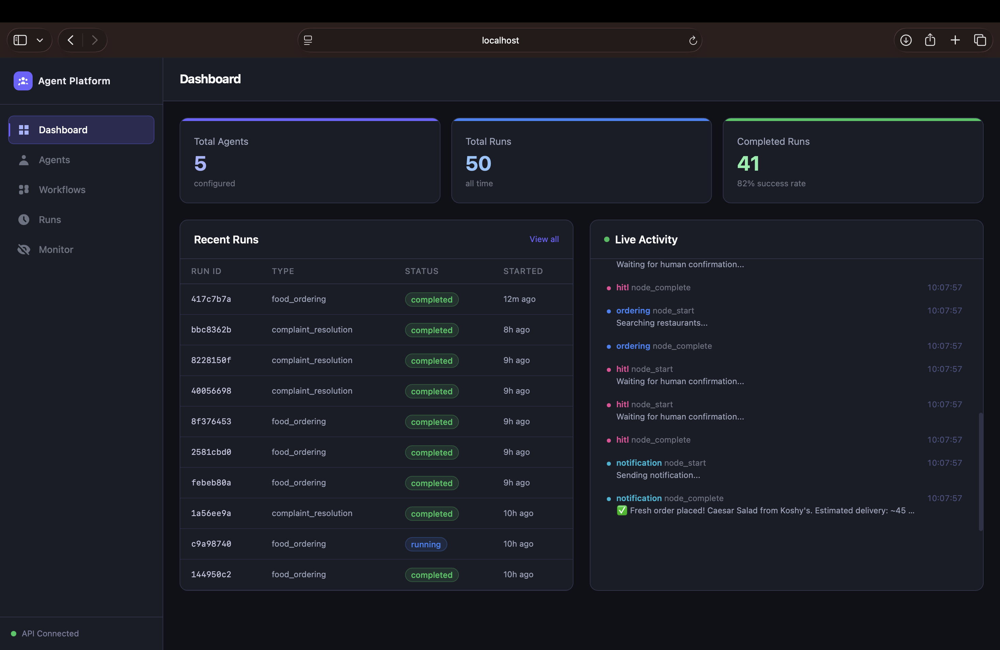 | 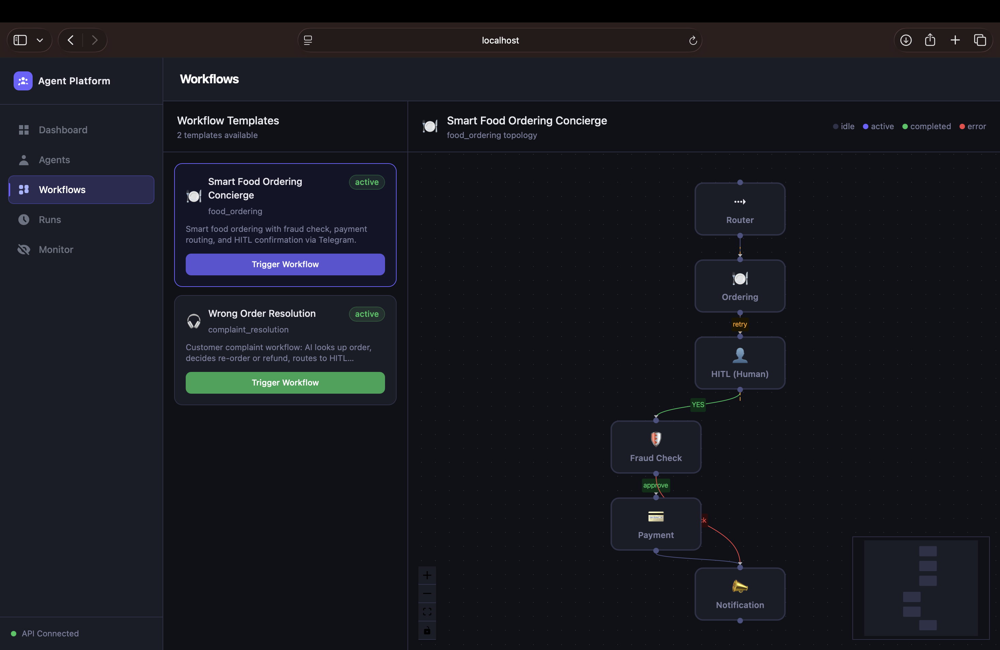 |

| Run monitor | UI human review |
|---|---|
| 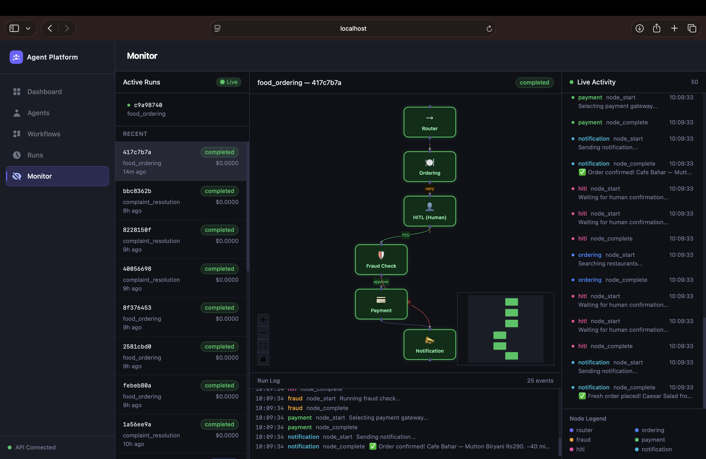 | 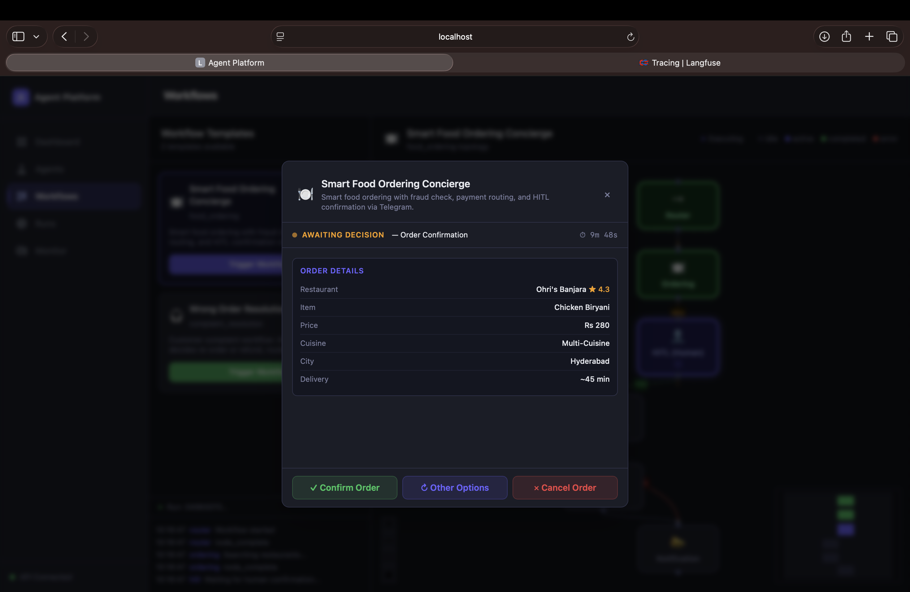 |

| Telegram ordering | Telegram complaint resolution |
|---|---|
| 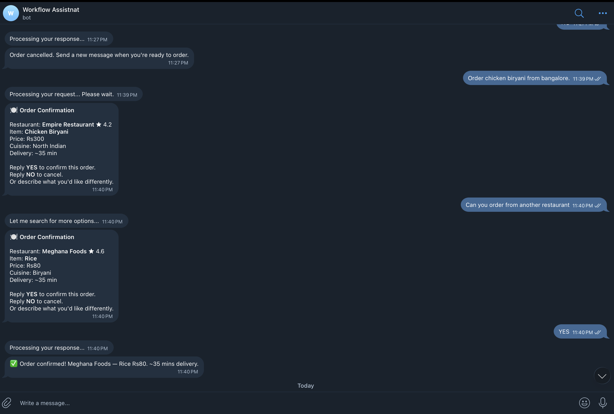 | 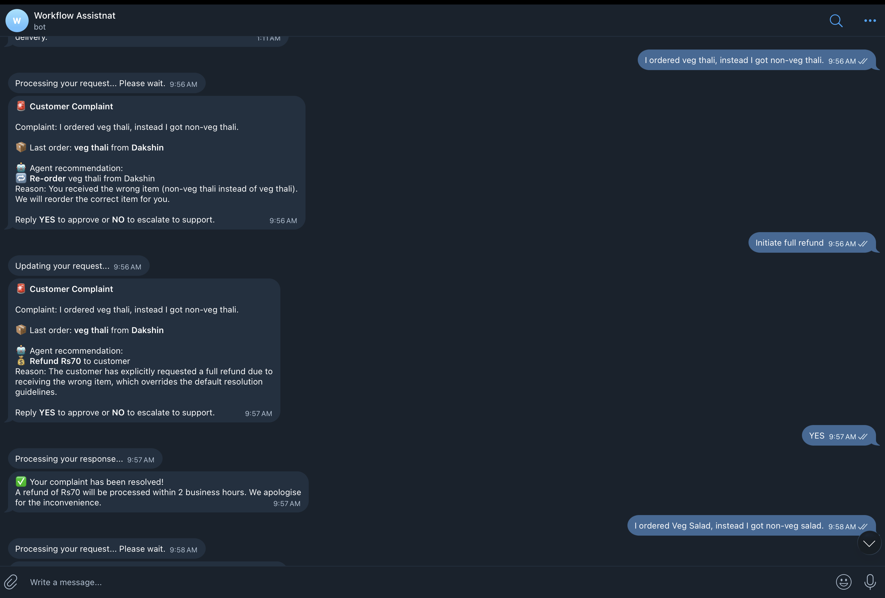 |

| Langfuse metrics | Langfuse trace detail |
|---|---|
| 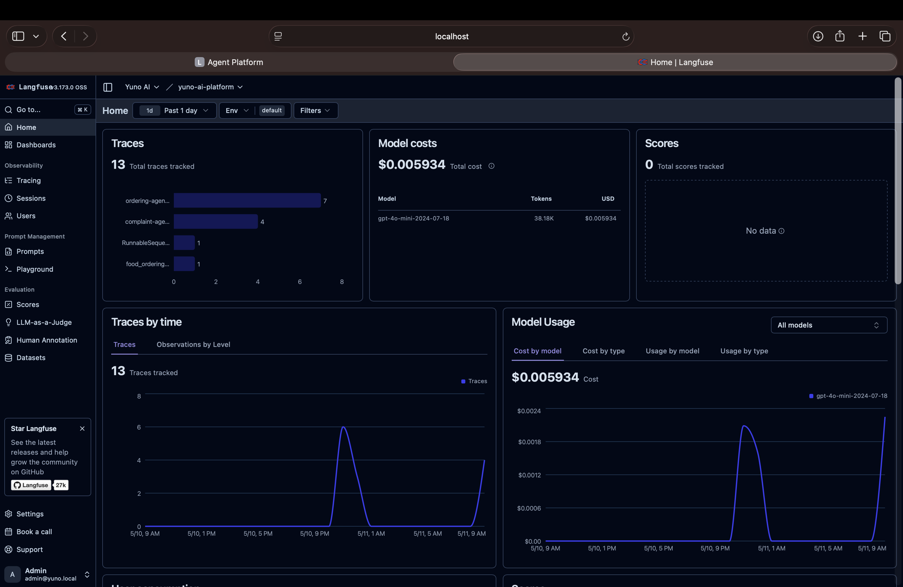 | 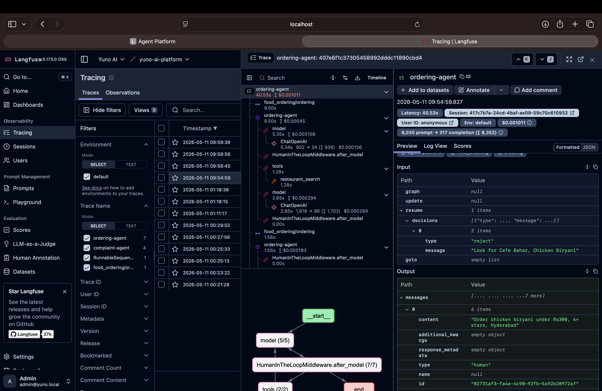 |

---

## Architecture


The platform has five runtime layers:

| Layer | Technology | Responsibility |
|---|---|---|
| Frontend | React + React Flow | Visual workflow builder, run dashboard, live monitoring |
| Backend | FastAPI | REST API, WebSocket streams, Telegram bot background task, MCP mount |
| Runtime | LangGraph StateGraph | Graph execution, conditional routing, HITL interrupt/resume |
| Tool layer | FastMCP at `/mcp/sse` | Business data access through six MCP tools |
| Data | PostgreSQL 15 + Redis 7 | SQLModel persistence, LangGraph checkpoints, event streams, HITL sessions |


### Key Engineering Decisions

| Decision | Rationale |
|---|---|
| LangGraph StateGraph for orchestration | The workflows need explicit, resumable control flow rather than open-ended agent conversation |
| PostgreSQL checkpointer for HITL | `AsyncPostgresSaver` preserves full workflow state while the user responds on Telegram |
| `thread_id = Telegram chat_id` | The same identifier is used to pause and resume the correct user session |
| FastMCP for business tools | Business data access is isolated behind tool interfaces instead of direct agent database queries |
| Redis for live sessions and streams | Redis keeps short-lived HITL session state and feeds real-time UI updates |
| Self-hosted Langfuse | Local traces, spans, token usage, and cost data remain visible during assessment runs |


### Docker Compose Services

| Service | Image | Role |
|---|---|---|
| `postgres` | pgvector/pgvector:pg15 | Primary database - agent configs, runs, seed data, HITL checkpoints |
| `redis` | redis:7-alpine | WebSocket event streaming + Telegram session state |
| `backend` | local build | FastAPI + LangGraph runtime + Telegram bot + MCP server |
| `frontend` | local build | React + Vite dev server |
| `langfuse-web` | langfuse/langfuse:3 | Observability UI (port 3001) |
| `langfuse-worker` | langfuse/langfuse-worker:3 | Async trace ingestion worker |
| `langfuse-postgres` | postgres:15 | Langfuse's own DB (separate from platform DB) |
| `langfuse-clickhouse` | clickhouse:24.12 | Langfuse trace analytics store |
| `langfuse-minio` | minio/minio | Langfuse object storage for events/media |
| `langfuse-redis` | redis:7-alpine | Langfuse internal queue |

---

## Service Endpoints

| Service | URL | Notes |
|---|---|---|
| Web UI | http://localhost:3000 | Main platform dashboard |
| API (REST) | http://localhost:8000 | FastAPI backend |
| Swagger docs | http://localhost:8000/docs | Interactive API explorer |
| Health check | http://localhost:8000/health | Returns `{"status": "ok"}` |
| MCP server | http://localhost:8000/mcp/sse | FastMCP SSE endpoint |
| Langfuse UI | http://localhost:3001 | LLM traces, costs, prompts |
| MinIO console | http://localhost:9001 | Langfuse object storage UI |

---

## Features

### Agent Management (CRUD)
- Create, read, update, and delete agents via the **Agents** page
- Per-agent configuration: name, role, system prompt, model (`gpt-4o` / `gpt-4o-mini`), tools, channels
- **Config-active badge**: agents whose DB config is actually loaded at runtime (`ordering`, `complaint`) are distinguished from fixed-behavior agents
- **Workflow usage badge**: each agent card shows which workflow templates reference its role
- Default agents seeded on startup from real Python agent modules - prompts always match what the runtime uses

### Workflow Builder
- Visual canvas powered by React Flow
- Nodes represent LangGraph graph nodes; edges show routing logic with labels (`approve`, `block`, `YES`, `retry`, `re-order`, `reprompt`)
- Loop-back edges shown as dashed lines (HITL retry, complaint reprompt, ordering → HITL)
- Nodes highlight with a pulsing indicator during live execution
- Trigger workflows directly from the canvas
- Two pre-loaded templates selectable from the UI

### Live Monitoring Dashboard
- Real-time event feed via WebSocket (`/ws/monitor`)
- Color-coded by node (`ordering` = blue, `fraud` = amber, `hitl` = pink, etc.)
- Every event includes `run_id` - Dashboard auto-refreshes the Runs table when a new run appears or when a workflow completes
- Token usage and execution timeline visible per run

### Run History
- Full execution event log stored in PostgreSQL per run
- Filterable by workflow type and status
- Drill-in panel shows execution events and token breakdown per agent node
- Status values: `running`, `hitl_pending`, `completed`, `failed`, `cancelled`

### Human-in-the-Loop (HITL)
- Powered by LangGraph `interrupt()` + `Command(resume=...)`
- Full AgentState persisted to PostgreSQL via `AsyncPostgresSaver`
- Users confirm or reject via **Telegram**; state resumes from exactly where it paused
- Session expires after 10 minutes with an expiry notification
- Nothing consequential (order placement, payment) executes without explicit user YES

### Telegram Integration
- Bot runs as a FastAPI background task on startup
- Handles multi-turn HITL conversation (`YES` / `NO` / `reprompt`)
- `thread_id = Telegram chat_id` - guarantees correct state resumption
- Active sessions tracked in Redis with TTL

### MCP Tool Layer (FastMCP)
Six tools mounted at `/mcp/sse` (SSE transport):

| Tool | Description |
|---|---|
| `restaurant_search` | Search 50 seeded restaurants by city, cuisine, price, rating |
| `menu_retrieval` | Fetch menu items for a restaurant |
| `order_lookup` | Retrieve a user's most recent order (for complaint resolution) |
| `payment_routing` | Select best gateway from 24 configured routes |
| `fraud_scoring` | Evaluate transaction against 30 rule-based fraud rules |
| `telegram_notify` | Send Telegram message via the platform bot |

Business tools are mock-backed with real interfaces, so restaurant, order, payment, and fraud data do not depend on live third-party APIs.

### Langfuse Observability (self-hosted)
See [Langfuse Observability](#langfuse-observability) section below.

---

## Workflow Templates

### Template 1 - Smart Food Ordering Concierge

**Trigger:** Telegram message or UI trigger  
**Example:** `Order chicken biryani under Rs300, 4+ stars, Hyderabad`


**Graph summary:** `router` → `ordering` → `hitl`; `YES` continues through `fraud` → `payment` → `notification`, retry loops back to `ordering`, and `NO`/expiry ends the workflow. Fraud blocks skip payment and go directly to notification.

**HITL checkpoint message (sent to Telegram):**
```text
Restaurant: Meghana Foods ⭐ 4.6
Item: Chicken Dum Biryani
Price: Rs280 · Delivery: ~35 mins
Payment: Juspay UPI · Fee: Rs5.60 · Total: Rs285.60
Risk score: 14/100 ✓

Reply YES to confirm or NO to cancel
```

**Alternate paths:**
- `NO` → Order cancelled
- `"show other options"` → re-runs ordering with relaxed constraints
- No reply in 10 min → session expired message

---

### Template 2 - Wrong Order Resolution

**Trigger:** Complaint message via Telegram or UI trigger  
**Example:** `I ordered chicken biryani but got veg biryani from Ohri's`


**Graph summary:** `router` → `complaint` → `fraud`; approved complaints pause at `hitl`, fraud blocks notify immediately, reprompts loop back to `complaint`, re-orders enter `ordering` and require a second food-confirmation HITL, and compensation/NO/expiry routes to `notification`.

**HITL checkpoint message:**
```text
Resolution for your complaint:
Re-order: Chicken Biryani from Paradise Restaurant
OR
Refund: Rs280 credit to your account

Reply YES to confirm or NO to cancel
```

**Resolution types:**
- `reorder` - wrong item received; re-search and place the correct order (goes through the Ordering sub-flow with its own HITL)
- `compensate` - quality issue, late delivery, or explicit refund request; issues INR credit

---

## HITL Flow (Human-in-the-Loop)

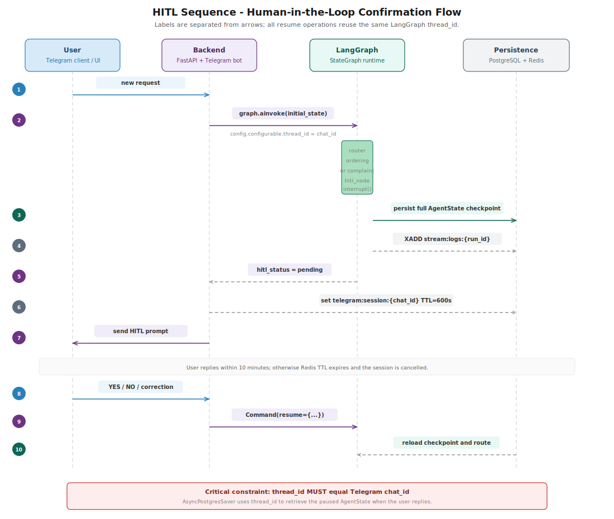

1. Workflow starts from the UI or Telegram with `graph.ainvoke(initial_state, config={"configurable": {"thread_id": chat_id}})`.
2. Nodes run until `hitl_node` calls `interrupt()`, at which point `AsyncPostgresSaver` persists the full `AgentState`.
3. The backend or Telegram bot sends the HITL prompt and stores `telegram:session:{chat_id}` in Redis with a 10-minute TTL.
4. The user replies `YES`, `NO`, or correction text on Telegram.
5. The bot resumes the graph with `Command(resume=...)`, using the same `thread_id`.
6. The graph resumes from the checkpoint and routes to fraud/payment/notification, retry, support escalation, or END.

Key constraint: `thread_id` MUST equal the Telegram `chat_id`. This is what enables correct state resumption across turns.

**Session expiry:** Redis TTL is 600 seconds for every HITL session. After 10 minutes without a reply, the bot clears the session and asks the user to start a new request.

| Action | Requires HITL |
|---|---|
| Placing a food order | **Yes - always** |
| Payment processing | **Yes - always** |
| Complaint resolution | **Yes - always** |
| Fraud scoring | No - internal decision |
| Restaurant search | No - research phase |
| Telegram notifications | No - autonomous |

---

## Code Architecture

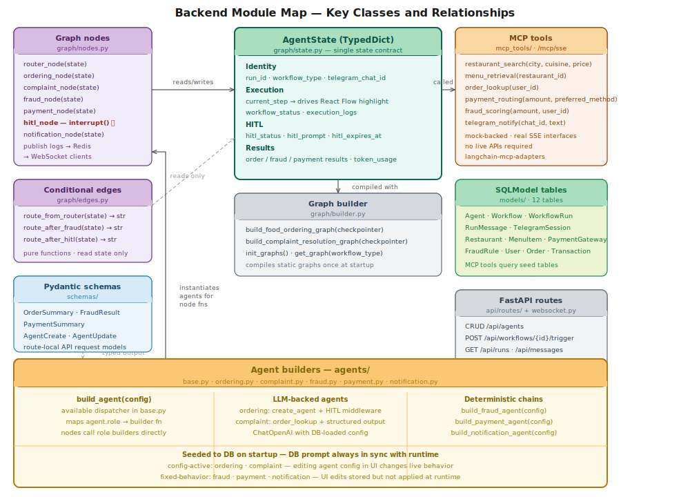

Key design rules enforced in the codebase:
- `AgentState` is the single state contract between graph nodes.
- LangGraph node names match React Flow node IDs exactly, which enables live node highlighting.
- Ordering and complaint agents load DB config at runtime; fraud, payment, and notification are deterministic fixed-behavior nodes.
- Agents access business data through MCP tools only; backend service code owns persistence tables such as `agents`, `workflow_runs`, and `run_messages`.

---

## Langfuse Observability

Langfuse runs as a fully self-hosted stack inside `docker compose up` - no external account needed.

### Access

| URL | Credentials |
|---|---|
| http://localhost:3001 | `admin@yuno.local` / `admin1234` |

Login credentials are configured by `LANGFUSE_INIT_USER_EMAIL`, `LANGFUSE_INIT_USER_NAME`, and `LANGFUSE_INIT_USER_PASSWORD` in `.env`.

### What is traced

Every agent node execution is wrapped in a `langfuse_node_span()` context manager:

- **Traces** - one trace per node execution, grouped under a single session per workflow run (`session_id = run_id`)
- **Deterministic trace IDs** - `uuid5(run_id + node_name)` ensures that both the initial execution and any HITL-correction re-runs of the same node appear under the same Langfuse trace
- **LangChain callbacks** - the Langfuse `CallbackHandler` is injected into every agent invocation, capturing input/output tokens, latency, and model name automatically
- **Graceful degradation** - if Langfuse keys are absent or the service is unreachable, `langfuse_node_span()` is a no-op and the workflow continues normally

### Configuration

Langfuse runs locally with `docker compose up`, but traces are only visible after the backend has a valid Langfuse API key pair.

For the local self-hosted setup:

1. Open http://localhost:3001.
2. Log in with `LANGFUSE_INIT_USER_EMAIL=admin@yuno.local` and `LANGFUSE_INIT_USER_PASSWORD=admin1234`.
3. Create or copy a project API key pair from the Langfuse project settings.
4. Paste those values into `.env`:

```env
LANGFUSE_PUBLIC_KEY=pk-lf-...
LANGFUSE_SECRET_KEY=sk-lf-...
LANGFUSE_HOST=http://localhost:3001
LANGFUSE_BASE_URL=http://localhost:3001
```

5. Restart the backend so `core.observability.langfuse_node_span()` can attach Langfuse callbacks.

To use Langfuse Cloud instead of self-hosted, set:
```env
LANGFUSE_PUBLIC_KEY=pk-lf-...
LANGFUSE_SECRET_KEY=sk-lf-...
LANGFUSE_HOST=https://cloud.langfuse.com
LANGFUSE_BASE_URL=https://cloud.langfuse.com
```
Create those keys in your Langfuse Cloud project. You can remove the `langfuse-*` services from `docker-compose.yml` when using Cloud.

---

## MCP Tool Layer

Tools are implemented with FastMCP and mounted as an ASGI sub-application at `/mcp/sse` alongside FastAPI.

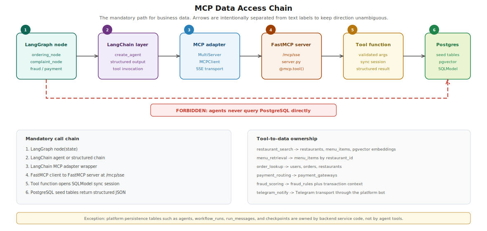

| Tool | Backing data | Purpose |
|---|---|---|
| `restaurant_search` | 50 seeded restaurants + menu embeddings | Search by city, cuisine, price, rating, and restaurant name |
| `menu_retrieval` | ~500 menu items | Fetch available items for a restaurant |
| `order_lookup` | 500 historical orders + users/restaurants | Retrieve recent order context for complaint resolution |
| `payment_routing` | 24 gateway configurations | Select payment gateways by success rate, method, and fee |
| `fraud_scoring` | 30 rule-based fraud rules + transaction context | Evaluate transaction risk and approve/block |
| `telegram_notify` | Platform Telegram bot | Send user-facing workflow notifications |

**Rule:** Agents never query PostgreSQL directly. All business data access goes through MCP tools.

Exception: persistence tables (`agents`, `workflow_runs`, `run_messages`) are managed by the backend service layer only.

---

## Running Tests

Tests run inside Docker where all services are available:

```bash
# Run all tests
docker compose exec backend pytest tests/ -v

# Agent CRUD only (no LLM calls)
docker compose exec backend pytest tests/test_agent_crud.py -v

# WebSocket + Redis event delivery
docker compose exec backend pytest tests/test_websocket_delivery.py -v

# Graph topology + schema checks (no LLM)
docker compose exec backend pytest tests/test_workflow_execution.py::test_graph_compiles \
  tests/test_workflow_execution.py::test_agent_state_schema \
  tests/test_workflow_execution.py::test_edges_compile \
  tests/test_workflow_execution.py::test_nodes_importable -v

# Full LLM integration tests (requires OPENAI_API_KEY)
docker compose exec backend pytest tests/test_workflow_execution.py -v

# With coverage
docker compose exec backend pytest tests/ -v --cov=. --cov-report=term-missing
```

Tests marked `@requires_openai` skip cleanly when `OPENAI_API_KEY` is absent or still the placeholder value.

---

## Environment Variables

See `.env.example` for full documentation. Minimum required to run:

| Variable | Required | Description |
|---|---|---|
| `OPENAI_API_KEY` | **Yes** | OpenAI API key (`sk-...`) |
| `TELEGRAM_BOT_TOKEN` | Yes (for HITL) | Token from @BotFather |
| `POSTGRES_*` | Auto (Docker) | Set by docker-compose defaults |
| `REDIS_*` | Auto (Docker) | Set by docker-compose defaults |
| `SEED_DATA_ON_STARTUP` | Optional | Default: `true` (idempotent - skips if already seeded) |
| `LANGFUSE_PUBLIC_KEY` | Required for traces | Create/copy from local Langfuse or Langfuse Cloud project settings |
| `LANGFUSE_SECRET_KEY` | Required for traces | Create/copy from local Langfuse or Langfuse Cloud project settings |
| `LANGFUSE_HOST` | Optional | Default: `http://localhost:3001` (self-hosted) |
| `LANGFUSE_INIT_USER_EMAIL` | Optional | Langfuse admin login (default: `admin@yuno.local`) |
| `LANGFUSE_INIT_USER_NAME` | Optional | Langfuse admin display name (default: `Admin`) |
| `LANGFUSE_INIT_USER_PASSWORD` | Optional | Langfuse admin password (default: `admin1234`) |

---

## Seed Data

All seed data is loaded from static JSON files in `mock_data/` - no live API calls on startup.

| Dataset | Count | Detail |
|---|---|---|
| Restaurants | 50 | 10 per city: Bangalore, Mumbai, Delhi, Hyderabad, Chennai |
| Menu items | ~500 | ~10 items per restaurant, with pgvector embeddings |
| Payment gateways | 24 | 6 gateways × 4 payment methods |
| Fraud rules | 30 | Rule-based scoring engine |
| Users | 20 | Simulated user profiles |
| Orders | 500 | Historical order data |
| Transactions | 200 | Mix of successful, failed, and flagged |
| Agents | 5 | Default agents seeded from Python module constants |
| Workflow templates | 2 | food_ordering, complaint_resolution |

Seeding is idempotent. The seeder checks for existing rows before inserting.
Agent records are upserted (not skipped) so prompt changes in Python code sync to DB on restart.


---

## Future Scope

The current repository focuses on a local assessment-ready implementation. The following items are intentionally listed as future scope, not current shipped behavior:

| Area | Potential enhancement |
|---|---|
| Production deployment | Package the stack with cloud deployment manifests, managed Postgres/Redis, secret rotation, and CI/CD release checks |
| Authentication and tenancy | Add user login, organization/workspace isolation, RBAC, and audit trails for agent and workflow changes |
| Additional channels | Extend the Telegram HITL pattern to WhatsApp, Slack, email, or in-app notifications using the same `thread_id` resume contract |
| Workflow marketplace | Support reusable workflow templates, versioned graph definitions, and import/export of workflow configurations |
| Evaluation harness | Add golden test datasets, LLM regression checks, prompt/version comparison, and Langfuse scorecards |
| Guardrails and policy controls | Add configurable approval thresholds, PII redaction, tool allowlists, and policy-based escalation rules |
| Durable background execution | Move long-running workflow execution to a queue/worker model with retries, dead-letter handling, and operational alerts |
| Observability maturity | Add service metrics, alerting, trace sampling, and dashboard-level SLOs for workflow latency and failure rate |
| Multi-provider LLM support | Add provider abstraction for Anthropic, Gemini, Azure OpenAI, local models, and model routing/fallback policies |
| Real integrations | Replace mock-backed restaurant, payment, fraud, and notification datasets with sandbox or production partner APIs |


---

## Project Structure

```text
yuno-ai-assessment/
├── docker-compose.yml
├── docker/
│   └── clickhouse/config.d/    # ClickHouse config for Langfuse
├── .env.example
├── README.md
├── CLAUDE.md                   # Project constitution - single source of truth
├── mock_data/                  # Static seed JSON (never fetched from live APIs)
│   ├── restaurants.json
│   ├── menus.json
│   ├── payment_routes.json
│   ├── fraud_rules.json
│   ├── users.json
│   ├── orders.json
│   └── transactions.json
├── backend/
│   ├── Dockerfile
│   ├── requirements.txt
│   ├── pytest.ini
│   ├── main.py                 # FastAPI app + lifespan (tables, seeder, bot, graphs)
│   ├── api/
│   │   ├── routes/
│   │   │   ├── agents.py       # Agent CRUD
│   │   │   ├── workflows.py    # Workflow list + trigger + HITL resume
│   │   │   ├── runs.py         # Run history + run detail + HITL state
│   │   │   └── messages.py     # Run message history
│   │   └── websocket.py        # /ws/logs/{run_id} + /ws/monitor
│   ├── agents/
│   │   ├── base.py             # get_mcp_tools() - resolves tools from MCP server
│   │   ├── ordering.py         # ORDERING_SYSTEM, ORDERING_TOOLS, build_ordering_agent()
│   │   ├── fraud.py            # FRAUD_PROMPT, FRAUD_TOOLS, build_fraud_agent()
│   │   ├── payment.py          # PAYMENT_PROMPT, PAYMENT_TOOLS, build_payment_agent()
│   │   ├── notification.py     # NOTIFICATION_PROMPT, NOTIFICATION_TOOLS
│   │   └── complaint.py        # COMPLAINT_SYSTEM, COMPLAINT_TOOLS, run_complaint_analysis()
│   ├── graph/
│   │   ├── state.py            # AgentState TypedDict
│   │   ├── nodes.py            # All node functions + _log() + _load_agent_config()
│   │   ├── edges.py            # Conditional routing functions
│   │   └── builder.py          # build_*_graph() + init_graphs() + get_graph()
│   ├── mcp_tools/
│   │   ├── server.py           # FastMCP app - mounted at /mcp/sse
│   │   ├── restaurant_search.py
│   │   ├── menu_retrieval.py
│   │   ├── order_lookup.py
│   │   ├── payment_routing.py
│   │   ├── fraud_scoring.py
│   │   └── notification.py
│   ├── tg_bot/
│   │   └── bot.py              # Telegram bot + HITL dispatcher (runs as background task)
│   ├── models/
│   │   ├── agent.py            # Agent table
│   │   ├── workflow.py         # Workflow table
│   │   ├── run.py              # WorkflowRun table
│   │   ├── message.py          # RunMessage table
│   │   └── seed_data.py        # Restaurant, MenuItem, PaymentGateway, FraudRule, etc.
│   ├── schemas/                # Pydantic request/response models
│   ├── core/
│   │   ├── config.py           # pydantic-settings (reads .env)
│   │   ├── database.py         # Async PostgreSQL + AsyncPostgresSaver init
│   │   ├── redis_client.py     # Redis Streams - publish_log_event()
│   │   ├── checkpointer.py     # Global AsyncPostgresSaver singleton
│   │   └── observability.py    # langfuse_node_span() context manager
│   ├── scripts/
│   │   └── seed.py             # _upsert_default_agents() + _upsert_workflow_templates()
│   └── tests/
│       ├── conftest.py
│       ├── test_agent_crud.py
│       ├── test_websocket_delivery.py
│       └── test_workflow_execution.py
└── frontend/
    ├── Dockerfile
    ├── package.json
    ├── vite.config.ts
    ├── tailwind.config.ts
    └── src/
        ├── App.tsx
        ├── main.tsx
        ├── pages/
        │   ├── Dashboard.tsx   # Stat cards + Recent Runs (live refresh) + Live Activity
        │   ├── Agents.tsx      # Agent CRUD grid with workflow-usage badges
        │   ├── Workflows.tsx   # Workflow canvas + trigger modal
        │   ├── Runs.tsx        # Run history table + detail panel
        │   └── Monitor.tsx     # Full-screen live event feed
        ├── components/
        │   ├── Layout.tsx      # Sidebar nav + topbar
        │   ├── WorkflowCanvas.tsx  # React Flow canvas with handles + live highlighting
        │   ├── AgentCard.tsx   # Agent card with config-active / workflow-usage badges
        │   ├── AgentForm.tsx   # Agent create/edit slide-over
        │   ├── MessageHistory.tsx
        │   ├── TokenTracker.tsx
        │   ├── HITLPanel.tsx
        │   └── Toast.tsx
        └── lib/
            ├── api.ts          # Typed API client (agents, workflows, runs, messages)
            ├── websocket.ts    # createLogStream + createMonitorStream (auto-reconnect)
            └── utils.ts        # relativeTime (UTC-aware), truncateId, STATUS_COLORS
```

---

## Runtime & Framework Choices

### Why LangGraph StateGraph

LangGraph was chosen over CrewAI, AutoGen, and custom solutions:

**1. Explicit topology** - Nodes and edges are defined in code, not inferred at runtime. The graph matches exactly what the React Flow canvas displays. Bugs trace to a specific node function.

**2. First-class HITL via `interrupt()`** - Pausing mid-workflow and resuming on a Telegram reply is the core requirement. `interrupt()` + `Command(resume=...)` is the native primitive. No custom state machine.

**3. Persistent checkpoints** - `AsyncPostgresSaver` persists full `AgentState` between Telegram turns. A user can reply hours later and the workflow resumes from exactly where it stopped.

**4. Conditional routing** - `add_conditional_edges()` cleanly implements fraud-based routing and complaint resolution with pure Python. No DSL, YAML, or runtime graph compiler.

**5. Production-ready** - Handles async concurrency, multi-tenant state isolation, and stream processing out of the box.

| Alternative | Why not chosen |
|---|---|
| CrewAI | No native `interrupt()` / checkpoint resume primitive for HITL across Telegram turns |
| AutoGen | Conversation-centric rather than graph-centric; harder to map directly to React Flow topology |
| Custom runtime | Would require rebuilding async checkpointing, conditional routing, and resume semantics |
| LangGraph | First-class `interrupt()`, `AsyncPostgresSaver`, explicit graph topology, and async execution |

### Tech stack

| Layer | Technology | Version | Why chosen |
|---|---|---|---|
| Agent runtime | LangGraph StateGraph | latest stable | Explicit topology plus durable HITL interrupt/resume |
| Agent framework | LangChain `create_agent` | latest stable | Tool-calling agent abstraction with middleware support |
| HITL middleware | HumanInTheLoopMiddleware (LangChain) | latest stable | Intercepts consequential tool calls before execution |
| MCP server | FastMCP | latest stable | Lightweight local SSE tool server |
| MCP client | langchain-mcp-adapters | latest stable | Exposes MCP tools as LangChain tools |
| Backend API | FastAPI | 0.115.x | Async REST/WebSocket API with strong typing |
| ORM | SQLModel | latest stable | Pydantic + SQLAlchemy models in one schema |
| Database | PostgreSQL 15 + pgvector | pg15 | Relational persistence plus vector search for menu items |
| Event streaming | Redis Streams | 7.x | Simple fan-out for live logs and monitor feeds |
| Observability | Langfuse (self-hosted) | 3.x | Local trace, span, and token/cost visibility |
| Telegram | python-telegram-bot | 21.x | Async Telegram polling and message handling |
| Frontend | React + Vite | React 18, Vite 5 | Fast local UI iteration and typed component model |
| Workflow canvas | React Flow | 11.x | Visual graph canvas matching LangGraph topology |
| Styling | Tailwind CSS | 3.x | Fast utility styling for the dashboard UI |
| LLM provider | OpenAI GPT-4o / GPT-4o-mini | latest | Strong general reasoning with cost-effective mini option |
| Deployment | Docker Compose | v2 | One-command local stack with all dependencies |


---

## License

This project is released under the MIT License. See [LICENSE](LICENSE) for details.

---

*Assessment: Yuno AI Team - AI Engineer Hiring Challenge*
